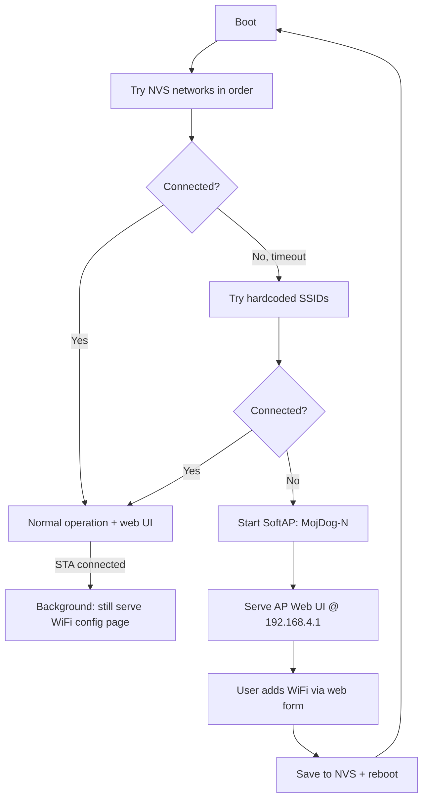

# SoftAP Captive Portal + WiFi Provisioning — Implementation Plan

## Overview

When the dogbot can't find any known WiFi within a configurable timeout, it already falls back to SoftAP mode. This plan extends that to include:

1. **A full control web UI** served at `192.168.4.1` in AP mode (same look as the STA UI, minus internet-dependent features like TTS)
2. **WiFi provisioning** — a form to enter new SSID/password, stored in NVS (survives reboots)
3. **Smart credential management** — NVS-stored networks are tried first, hardcoded ones are deprioritized but kept as fallback
4. **Captive portal DNS** — redirects all DNS queries to 192.168.4.1 so phone users see the portal automatically

## Architecture

## Changes by File

### 1. `wifi_mgr.c` / `wifi_mgr.h` — NVS credential store + multi-network scan

**Current:** Hardcoded `WIFI_SSID_1`/`WIFI_SSID_2` array, 12s fallback timer.

**New:**
- On boot, read NVS namespace `"wifi"` for keys `ssid_0..ssid_N` + `pass_0..pass_N` and `count`
- Build a combined network list: NVS entries first, then hardcoded ones
- Configurable fallback timeout via `#define AP_FALLBACK_MS` (keep 12000, but user said 10s — we can set to 10000)
- Add `wifi_save_credentials(ssid, pass)` — appends to NVS, deprioritizes existing entries
- Add `wifi_get_mode()` — returns whether we're in STA or AP mode (for UI to hide TTS)
- Add captive portal DNS responder task (responds to all DNS queries with 192.168.4.1)
- **DO NOT TOUCH** the initial `esp_wifi_connect()` flow or timing for STA — it still connects in <4s

### 2. `webserver.c` — WiFi config page + AP-aware UI

**Current:** Single `root_get_handler` serving the control UI.

**New:**
- Add `GET /wifi` endpoint — returns JSON list of saved networks
- Add `POST /wifi` endpoint — accepts `{ssid, password}`, saves to NVS, reboots
- Add `GET /wifi_scan` endpoint — triggers WiFi scan and returns visible SSIDs
- Modify `root_get_handler` HTML to include a **WiFi Setup** card at the bottom
- When in AP mode, the TTS card is hidden (no internet), and a prominent WiFi setup section appears at top
- The `/wifi` page also works when connected to STA (so user can pre-configure networks)

### 3. `config.h` / `board_config.h` — New config defines

- `#define AP_FALLBACK_TIMEOUT_MS  10000` — configurable timeout
- `#define MAX_NVS_NETWORKS  8` — max stored WiFi networks
- `#define ENABLE_CAPTIVE_PORTAL  1` — enable/disable DNS redirect

### 4. `main/CMakeLists.txt`

- No new source files needed — all logic lives in existing `wifi_mgr.c` and `webserver.c`

## Key Design Decisions

| Decision | Choice | Rationale |
|----------|--------|-----------|
| Storage | NVS key-value | Already initialized, no SPIFFS needed, survives OTA |
| DNS captive portal | Lightweight UDP task | Auto-opens portal on phones, <1KB RAM |
| Credential priority | NVS first, hardcoded fallback | User-added WiFi takes priority over compiled ones |
| UI approach | Same embedded HTML | Consistent look, no external dependencies |
| Reboot on new WiFi | Yes | Cleanest way to re-init WiFi stack with new creds |

## What We DON'T Touch

- ❌ Initial WiFi connect timing (the <4s STA connect)
- ❌ LED breathing / audio announcement behavior
- ❌ Existing servo, OTA, or SSE infrastructure
- ❌ The `secrets.h` hardcoded credentials (they remain as fallback)

## Implementation Order

1. `wifi_mgr.c` — NVS read/write + DNS captive portal
2. `webserver.c` — WiFi scan/save endpoints + UI cards  
3. `board_config.h` — Add config defines
4. Test flow: boot with no known WiFi → AP mode → configure → reboot → connects
